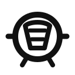

<section class="dashboard-shell" aria-labelledby="dashboard-title">
  <h1 id="dashboard-title" class="dashboard-heading">MUUC tools</h1>
  
Quick access to tools and reports.

  

    <a class="dashboard-tile finance-theme" href="https://muuc.sek-lab.com" aria-label="Open Finance">
      
        
      
      <h2 class="dashboard-title">Finance</h2>
      
Review club finances, updated monthly.

    </a>

    <a class="dashboard-tile upload-theme" href="https://muuc-upload.sek-lab.com/" aria-label="Open Upload Portal">
      
        
      
      <h2 class="dashboard-title">Upload Portal</h2>
      
Upload and track your receipts, invoices, refund requests.

    </a>

    <a class="dashboard-tile trip-theme" href="https://trip.muuc.org.au" aria-label="Open Trip Organiser">
      
        
      
      <h2 class="dashboard-title">Trip Organiser</h2>
      
Track Memberships, Gear and Boat payments.

    </a>

    <a class="dashboard-tile treasury-theme" href="https://muuc.sek-lab.com/treasury-report" aria-label="Open Treasury Report">
      
        
      
      <h2 class="dashboard-title">Treasury Report</h2>
      
Access the 2025 Treasury Report.

    </a>
  

</section>
